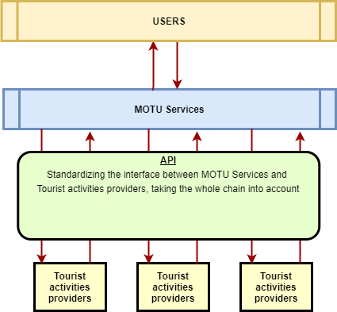

Together with the MOTU project team, process flows for the customer journey have been defined. This helps to scope the necessary functions required in the API building blocks. The goal is to accommodate different business models and variations of Tourist scenarious within these functional flows.

## MOTU-API-Architecture

- Operator Information / General Information: Gives static information on the provider according to the MOTU standard.
- Privacy and Registration
- Planning: Gives information about availability, estimated travel time and costs.
- Booking: Allows reservation of specific assets for a specific place, time and date.
- Trip Execution: Allows access to the asset(s) and travel during the booked period.
- Payment: Allows settlement between Provider and Tourist. Supports different business models (i.e., pay-as-you-go or subscription-based).
- Support: Assists users in the solution of operational troubles encountered during any part of the process. Connects with optional support modules.
- Asset Information: Is defined as a separate module that can be used by other modules to supplement API calls with specific asset information where applicable.
- Optional modules: The more dynamic functional blocks have additional optional modules which are used for the execution of sub-processes derived from the main functions which might not be desired or required depending on the scope of the Business Models.