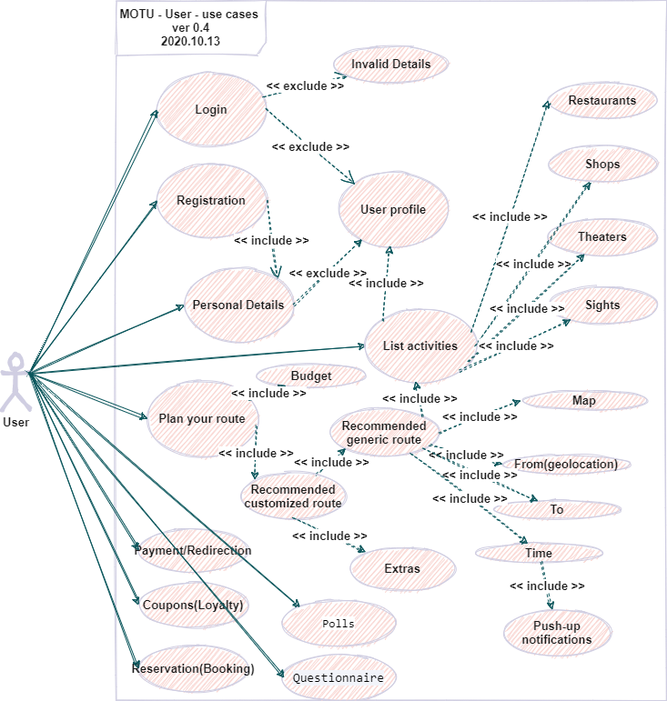

# Specifiaction for MOTU api

## Table of Contents

- [Specifiaction for MOTU api](#specifiaction-for-motu-api)
  - [Table of Contents](#table-of-contents)
  - [Summary](#summary)
  - [Model managemenet](#model-managemenet)
  - [User interfaces](#user-interfaces)
  - [Provider interfaces](#provider-interfaces)
  - [Timing](#timing)
      - [Personnel](#personnel)
      - [Glossary](#glossary)
      - [Business documents](#business-documents)
      - [Solution](#solution)

## Summary

With MOTU travellers can plan, book, involve in loyalty program and execute their trips using any available pay for all of them via integrated apps. For MOTU to be successful, providers are required to share their services and availability of their assets in a digital form. To facilitate MOTU providers and thus enable the deployment of MOTU services, providers are also required to standardize the digital form to facilitate access to their information. The MOTU-API (MyOpenTour - Application Programming Interface) is a standardized and technical interface between MOTU, users, providers and other MOTU services.

Concept of having a standard-based Application Programming Interface (API) from MOTU to or from services and applications. It allows all participating companies to communicate about planning, booking, execution, support, general information and payments of end-user specific iternerary. Using the MOTU-API enhances the interoperability between parties in the MOTU ecosystem.

In this Blueprint for an API for the MOTU-API we look into the necessary functional requirements for the interoperability between involved roles and MOTU. The goal of this document is to:

- Define the necessary scope for full interoperability between roles for the deployment of MOTU services, always keeping the customer journey in mind to determine which API calls are needed between MOTU services and other involved roles.
- Define the necessary parameters and values to fulfil this scope.
- Define the available parameters in various already available APIs and propose amendments where applicable.

Who is involved?

This document has been written to consolidate the work of the MOTU web services. The MOTU is a company started in the Russian Federation in 2020. The goal of envolved persons is to provide standardised APIs to facilitate the development of the MOTU ecosystem. MOTU-API will be used as standard for the several MOTU pilots in The Russian Federation. Since 2021 the MOTU has been moved to become a company with an international scope. A list with all collaborators, companies and stakeholders involved in the current design and development of the MOTU-API has to be provided in Appendix

What is in this version?

The first implementations of the MOTU-API will took place in a couple of months. The API is now capable of describing a full MOTU journey.

These results are especially reflected in a simplified object model in the planning phase and a new endpoint with self-describing facilities was created. This last one is needed for (inter)national scale-up, to be informed of what the addressed providers is capable of.

Versioning and releases

Changes in the API are inevitable since we are exploring a new field and knowledge and experience improves. These changes are controlled using milestones and semantic versioning. First, the product owners defines functional milestones for the API. The milestones refer to new capabilities of the API at a point in time. The most recent version of this document contains all functional aspects of a MOTU journey, (provider information, planning, booking, iternarary, payment, support). Milestones have simple enumerated number names. Secondly, for developers and implementors of MOTU services, semantic versioning is used. Semantic versioning means that by looking at our version number, you can quickly identify what has changed and how much work goes into changing your own implementation.

Technical Specifications

The technical working group suggests implementing this interface using REST-APIs with GraphQl or JSON-API specification(Swagger).
Other quality specifications are:

MOTU-API-Architecture:

MOTU-Model-Data-Class-Diagram:

## Model managemenet

MOTU-User Use cases latest available diagram:

User Activity latest available diagram:

## User interfaces

MOTU-Provider Use cases latest available diagram:

## Provider interfaces

- Model
  - Company name
  - Nickname in the system
  - Logo
  - Photo download / edit 4+
  - Address of POI, (shown on the map)
  - Tel/e-mail (add. A second)
  - Opening hours
  - Discount
  - Description (100 symbols)
  - Rating (by MOTU or Tripadisor)
  - Banner for catalog
  - Pricelist (in Tourist’s currency)
  - Link to the account: web, Insta, FB, vk
- Questionnaire
- Listing service
  - Requested listing
  - Displaying activities on the map(geolocation)
  - Restaurants
  - Theaters
  - Shops
  - Sights
  - Galleries
  - Analytics: % prefer this or that (based on ...)
- Activities
  - Activities from providers
  - User reviews
  - Statistics
    - min/max revenue per user
    - transactions data (cash memory)
  - Analytics
    - Average revenue per user
    - Comparison with the previous month
    - Etc.
- Coupons
  - created
  - burned
- Bonuses
  - transferred to a friend
  - saldo
- Payments
- FAQs
- Ask your question
- Settings
- Media Library

## Timing

The mvp version 1.0.0 should be released on 01.06.2021, maximum delay period is 2 months.

#### Personnel

Estimated team composition:
2 developer, 1 designer, 1 project manager, 1 tester, 1 product owner & tech lead, 1 DevOps, 1 business analyst

#### Glossary

| Name                      | Definition                                                                                                                                                                                                                           | Synonyms           | Source                                                                  |   |
|---------------------------|--------------------------------------------------------------------------------------------------------------------------------------------------------------------------------------------------------------------------------------|--------------------|-------------------------------------------------------------------------|---|
| Tourist                   | One that makes a tour for pleasure or culture, wanting to make a journey, plan an itinerary                                                                                                                                          | User, Customer     | https://www.merriam-webster.com/dictionary/tourist                      |   |
| Marketplace               | Is the interpreter of supply and demand                                                                                                                                                                                              |                    | https://www.merriam-webster.com/dictionary/marketplace                  |   |
| Itinerary                 | The route of a journey or tour or the proposed outline of one, a traveler's guidebook , a travel diary                                                                                                                               | Route              | https://www.merriam-webster.com/dictionary/itinerary                    |   |
| Personal recommendations  | recommendations(itinerary) for authorized tourists                                                                                                                                                                                   |                    | https://github.com/MyOpenTour/MOTU-Project/blob/master/docs/glossary.md |   |
| Generic recommendations   | Recommendations for unauthorised tourists                                                                                                                                                                                            | itinerary          | https://github.com/MyOpenTour/MOTU-Project/blob/master/docs/glossary.md |   |
| Recommendation            | List of recommended activities                                                                                                                                                                                                       |                    | https://github.com/MyOpenTour/MOTU-Project/blob/master/docs/glossary.md |   |
| Planning                  | The process of making or carrying out tourist journey itinerary                                                                                                                                                                      |                    |                                                                         |   |
| Booking                   | The process of making a reservation for space on a means of provider assets                                                                                                                                                          |                    |                                                                         |   |
| Booking Process           | The process involving those steps necessary to make a reservation, possibly including: - Query of route - Select preferred option - Request reservation - Accept terms and conditions (incl. payment) - Get reservation confirmation |                    |                                                                         |   |
| Booking State             | The situation at a particular time during the booking process: Started, Pending, Released, etc…                                                                                                                                      |                    |                                                                         |   |
| Availability              | The ability of an asset to perform a required function under given conditions at a given instant in time, or over a given time interval, assuming that the required external resources are provided.                                 |                    |                                                                         |   |
| Payment                   |                                                                                                                                                                                                                                      |                    |                                                                         |   |
| Loyalty program           |                                                                                                                                                                                                                                      |                    |                                                                         |   |
| Provider                  | Provider of travel advice, information, booking and invoicing owned and operated by private entities or gov                                                                                                                          | Partner            |                                                                         |   |
| Activity                  | providers'/partners' businesses in business catalog                                                                                                                                                                                  |                    | https://github.com/MyOpenTour/MOTU-Project/blob/master/docs/glossary.md |   |
| Tourist Journey           | A collection of segments which satisfies tourist demand for a given origin and destination.                                                                                                                                          |                    |                                                                         |   |
| Business catalog          | a list of providers' activities                                                                                                                                                                                                      | providers' supply  | https://github.com/MyOpenTour/MOTU-Project/blob/master/docs/glossary.md |   |
#### Business documents
Business documents flow is located at Google Drive and available at https://drive.google.com/drive/u/0/folders/1Pp-PsoKLqElKZkmV_NSApInUfGuBVknp
#### Solution

Generated on previous steps artifacts and other software quality attributes define stack and implementation.  

- app.diagram.net and Cawemo for free BMPN and UML modelling
- Recommendation service is Python\Flask\Django web api work on the same model schema to communicate with Data Store with its own DBs on the backend.
- Data Store is a MySQL, Mongo databases with web api realisation of domain model with CRUD, docs, and API versioning(PHP, Python, Node.js, any).
- For SEO recommended static html pages
- Some of pages have a huge logic backend, recommended to use modern PWA(express, Next, other SSR technics)
- We can use Wordpress or 1C Bitrix as CMS backend
- Firebase, STRAPI, Ecommerce CMS,...
- other decision will be Admin panel as a Vue Dashboard backed by PHP backend.
- Provider admin page is a Provider page on the mentioned above dashboard in the same technology stack.
- User admin page is a Provider page on the mentioned above dashboard in the same technology stack.
- User WEB PWA app have to be discussed more
- Provider WEB PWA app have to be discussed more
- User and Provider app Flutter from Google is the only decision on the market as of September 2020 which offers cross-platform development(Android/IOS/Mobile web). The project uses Flutter for User app we'll be using json-api or graphql model schema at the frontend for API specification.
